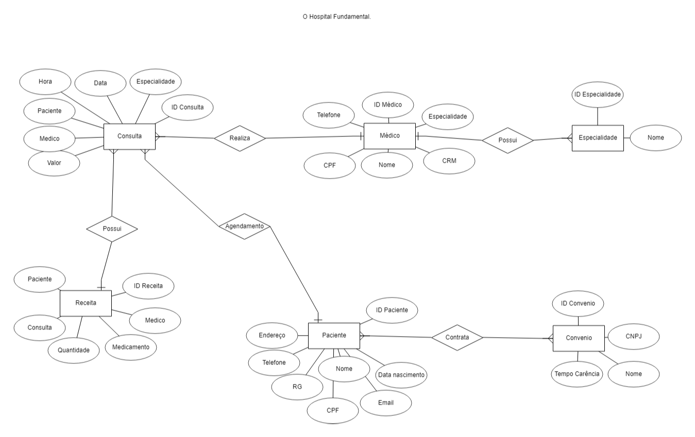
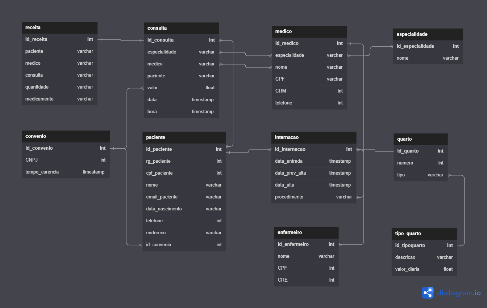

<h1 align="center"> Banco de Dados - Hospital </h1>
<br>
<h2 align="center">1ª PARTE - O Hospital Fundamental. </h2>
<h3 align="center"> Modelagem Conceitual: Entidade-relacionamento </h3>
<p> O hospital necessita de um sistema para sua área clínica que ajude a controlar consultas realizadas. Os médicos podem ser generalistas, especialistas ou residentes e têm seus dados pessoais cadastrados em planilhas digitais. Cada médico pode ter uma ou mais especialidades, que podem ser pediatria, clínica geral, gastroenterologia e dermatologia. Alguns registros antigos ainda estão em formulário de papel, mas será necessário incluir esses dados no novo sistema.</p>
<p> Os pacientes também precisam de cadastro, contendo dados pessoais (nome, data de nascimento, endereço, telefone e e-mail), documentos (CPF e RG) e convênio. Para cada convênio, são registrados nome, CNPJ e tempo de carência.</p>
<p> As consultas também têm sido registradas em planilhas, com data e hora de realização, médico responsável, paciente, valor da consulta ou nome do convênio, com o número da carteira. Também é necessário indicar na consulta qual a especialidade buscada pelo paciente.</p>
<p> Deseja-se ainda informatizar a receita do médico, de maneira que, no encerramento da consulta, ele possa registrar os medicamentos receitados, a quantidade e as instruções de uso. A partir disso, espera-se que o sistema imprima um relatório da receita ao paciente ou permita sua visualização via internet.</p>



<h2 align="center">2ª PARTE - Os Segredos do Hospital. </h2>
<h3 align="center"> Modelagem lógica</h3>
<p> No hospital, as internações têm sido registradas por meio de formulários eletrônicos que gravam os dados em arquivos. Para cada internação, são anotadas a data de entrada, a data prevista de alta e a data efetiva de alta, além da descrição textual dos procedimentos a serem realizados. As internações precisam ser vinculadas a quartos, com a numeração e o tipo. Cada tipo de quarto tem sua descrição e o seu valor diário (a princípio, o hospital trabalha com apartamentos, quartos duplos e enfermaria).</p>
<p> Também é necessário controlar quais profissionais de enfermagem estarão responsáveis por acompanhar o paciente durante sua internação. Para cada enfermeiro(a), é necessário nome, CPF e registro no conselho de enfermagem (CRE).</p>
<p> A internação, obviamente, é vinculada a um paciente – que pode se internar mais de uma vez no hospital – e a um único médico responsável.</p>



<h2 align="center">3ª PARTE - O Prisioneiro dos Dados  </h2>
<h3 align="center"> Povoamento inicial do sistema </h3>
Este repositório contém os scripts de povoamento das tabelas desenvolvidas na atividade anterior, conforme as regras estabelecidas. <br>Para garantir o bom funcionamento do sistema, é essencial que as seguintes atividades sejam observadas durante o povoamento inicial:

- Inclusão de pelo menos dez médicos de diferentes especialidades;
- Inclusão de pelo menos sete especialidades (considerando a afirmação de que “entre as especialidades há pediatria, clínica geral, gastrenterologia e dermatologia”);
- Inclusão de pelo menos 15 pacientes;
- Registro de 20 consultas de diferentes pacientes e médicos, com datas entre 01/01/2015 e 01/01/2022. Pelo menos dez consultas devem ter receituário com dois ou mais medicamentos;
- Inclusão de pelo menos quatro convênios médicos, com associação a pelo menos cinco pacientes e cinco consultas;
- Criação de entidade de relacionamento entre médico e especialidade;
- Criação de entidade de relacionamento entre internação e enfermeiro;
- Correção da chave estrangeira no relacionamento entre convênio e médico;
- Criação de entidade entre internação e enfermeiro;
- Inclusão de chaves estrangeiras dentro da tabela de internação (chaves de Médico e Paciente);
- Registro de pelo menos sete internações, com datas entre 01/01/2015 e 01/01/2022. Pelo menos dois pacientes devem ter se internado mais de uma vez. Pelo menos três quartos devem ser cadastrados;
- Inclusão dos dados de pelo menos três tipos de quarto (apartamento, quarto duplo e enfermaria), com valores diferentes;
- Inclusão dos dados de dez profissionais de enfermagem, com associação de cada internação a pelo menos dois enfermeiros.
Por fim, é importante destacar que os dados de tipo de quarto, convênio e especialidade são essenciais para a operação do sistema e, portanto, devem ser povoados assim que o sistema for instalado. Assim, garantimos que o sistema esteja completo e funcional desde o seu primeiro uso.

O script se encontra no repositório, "hospital.sql"

<h2 align="center">4ª PARTE - A Ordem do Alterar.  </h2>
<h3 align="center"> Alterações na tabela e dados. </h3>

No banco que já foi criado para o Projeto do Hospital, foi realizado algumas alterações nas tabelas e nos dados.
- Foi criado um script que adiciona uma coluna “em_atividade” para os médicos, indicando se ele ainda está atuando no hospital ou não. 
- Também foi criado um script para atualizar ao menos dois médicos como inativos e os demais em atividade.
```
ALTER TABLE medico ADD COLUMN em_atividade VARCHAR(20);
UPDATE medico SET em_atividade = 'Inativo' WHERE id_medico = 1;
...
UPDATE medico SET em_atividade = 'Em atividade' WHERE id_medico = 10;
ALTER TABLE medico ALTER COLUMN em_atividade SET DEFAULT 'Em atividade';
```

<h2 align="center">5ª PARTE - Consultas. </h2>
<h3 align="center">Script com consultas que retornam: </h3>

- Todos os dados e o valor médio das consultas do ano de 2020 e das que foram feitas sob convênio.

```
SELECT * FROM consulta WHERE YEAR(data_consulta) = 2020 OR id_convenio = 1;
SELECT AVG(valor) FROM consulta WHERE YEAR(data) = 2020 OR convenio = 1;
```

- Todos os dados das internações que tiveram data de alta maior que a data prevista para a alta.

```
SELECT * FROM internacao WHERE data_alta > data_prev_alta;
```

- Receituário completo da primeira consulta registrada com receituário associado.
```
SELECT * FROM receita WHERE consulta_id = (SELECT MIN(id_receita) FROM consulta);
```

- Todos os dados da consulta de maior valor e também da de menor valor (ambas as consultas não foram realizadas sob convênio).

```
SELECT * FROM consulta WHERE id_convenio = NULL ORDER BY valor DESC;
SELECT * FROM consulta WHERE id_convenio = NULL ORDER BY valor ASC;
```

- Todos os dados das internações em seus respectivos quartos, calculando o total da internação a partir do valor de diária do quarto e o número de dias entre a entrada e a alta.

```
SELECT i.id_internacao, i.data_entrada, i.data_prev_alta, i.data_alta, i.procedimento,
       q.numero AS numero_quarto, t.valor_diaria,
       DATEDIFF(i.data_alta, i.data_entrada) AS num_dias,
       DATEDIFF(i.data_alta, i.data_entrada) * t.valor_diaria AS total_internacao
FROM internacao i
JOIN quarto q ON i.id_internacao = q.id_quarto
JOIN tipo_quarto t ON q.id_tipoquarto = t.id_tipoquarto;
```
- Nome do paciente, data da consulta e especialidade de todas as consultas em que os pacientes eram menores de 18 anos na data da consulta e cuja especialidade não seja “pediatria”, ordenando por data de realização da consulta.
```
SELECT p.nome AS nome_paciente, c.data_consulta, e.nome AS especialidade
FROM consulta c
JOIN paciente p ON c.id_paciente = p.id_paciente
JOIN especialidade e ON c.especialidade_id = e.id_especialidade
WHERE TIMESTAMPDIFF(YEAR, STR_TO_DATE(p.data_nascimento, '%Y-%m-%d'), c.data_consulta) < 18
AND e.nome != 'Pediatria'
ORDER BY c.data_consulta;
```
- Nome do paciente, nome do médico, data da internação e procedimentos das internações realizadas por médicos da especialidade “gastroenterologia”, que tenham acontecido em “enfermaria”.
```
SELECT p.nome AS NomePaciente, m.nome AS NomeMedico, i.data_internacao, i.procedimentos
FROM internacao i
JOIN medico m ON i.id_medico = m.id_medico
JOIN paciente p ON i.id_paciente = p.id_paciente
JOIN especialidade_medico em ON m.id_medico = em.id_medico
JOIN especialidade e ON em.id_especialidade = e.id_especialidade
WHERE e.nome_especialidade = 'gastroenterologia'
  AND i.local_internacao = 'enfermaria'
```
- Os nomes dos médicos, seus CRMs e a quantidade de consultas que cada um realizou.
```
SELECT m.nome AS NomeMedico, m.CRM, COUNT(c.id_consulta) AS QuantidadeConsultas
FROM medico m
LEFT JOIN consulta c ON m.id_medico = c.id_medico
GROUP BY m.id_medico
```
- Todos os médicos que tenham "Gabriel" no nome. 
```
SELECT * FROM medico WHERE nome = "Gabriel";
```
- Os nomes, CREs e número de internações de enfermeiros que participaram de mais de uma internação.
```
SELECT e.nome AS NomeEnfermeiro, e.crm AS CRM, COUNT(i.id_internacao) AS NumeroInternacoes
FROM enfermeiro e
JOIN participacao p ON e.id_enfermeiro = p.id_enfermeiro
JOIN internacao i ON p.id_internacao = i.id_internacao
GROUP BY e.nome, e.crm
HAVING COUNT(i.id_internacao) > 1
```
